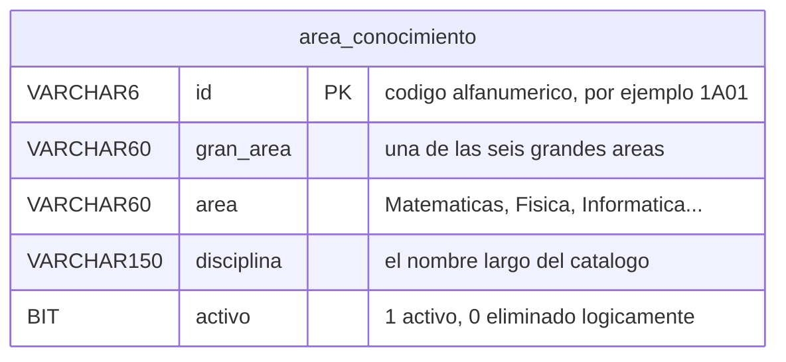

# Modelo de datos — Versión 1: la base dada y `area_conocimiento`

## 1. La base viene completa; la v1 nombra una tabla

La base `investigacion_local` se crea con sus **19 tablas** desde la
primera versión (Artículo 5): 16 del módulo y 3 de gestión de usuarios.
Eso es infraestructura **dada**, no algo que la v1 construya.

Lo que la v1 tiene permitido **nombrar en el código** es **una sola
tabla**: `area_conocimiento`. Cualquier `SELECT`, `INSERT` o `JOIN` que
mencione otra viola el alcance (Artículo 1).

## 2. La tabla `area_conocimiento`

| Columna | Tipo | Regla |
|---|---|---|
| `id` | `VARCHAR(6)` | **PK** — código alfanumérico del catálogo (`1A01`, `6E03`). Texto, no número (C1) |
| `gran_area` | `VARCHAR(60)` | No nulo, no vacío. Seis valores posibles (§3) |
| `area` | `VARCHAR(60)` | No nulo, no vacío |
| `disciplina` | `VARCHAR(150)` | No nulo. Ampliada desde 60 por el valor de 124 caracteres del catálogo (C2) |
| `activo` | `BOOLEAN NOT NULL DEFAULT TRUE` | Borrado lógico (C3). La API la escribe **solo** vía `DELETE` |



**La jerarquía del catálogo** es `gran_area → area → disciplina`, y el
`id` la codifica: el primer carácter es la gran área (`1` a `6`), la letra
es el área y los dos dígitos finales, la disciplina. `1A01` es la primera
disciplina, del área `A`, de la gran área `1`.

> La v1 **no valida esa estructura**: guarda el `id` como texto tal cual
> llega. Validar el formato del código sería una regla de negocio que
> ninguna versión ha pedido todavía.

## 3. Las semillas: 218 filas

Salen del Excel de referencia del módulo
(`Mapa_conocimiento/04_Modelo_y_Base_de_datos/Base de Datos v6.xlsx`,
hoja `area_conocimiento`). **Los criterios de aceptación dependen de estos
valores exactos:**

| Dato | Valor |
|---|---|
| Filas | **218** |
| Rango de códigos | `1A01` … `6E03` |
| Grandes áreas | Ciencias Naturales · Ingeniería y Tecnología · Ciencias Médicas y de la Salud · Ciencias Agrícolas · Ciencias Sociales · Humanidades |

Tres filas reales, para los ejemplos de los contratos:

```
1A01  Ciencias Naturales  Matemáticas  Matemáticas puras
1A02  Ciencias Naturales  Matemáticas  Matemáticas aplicadas
6E03  Humanidades         Otras Humanidades  Teología
```

> **Una corrección al catálogo (C9).** El Excel trae `Cienias Naturales`
> —sin la `c`— en las 48 filas de esa gran área. Se corrige al generar las
> semillas y queda anotado en la cabecera de `db/investigacion.sql`. Es un
> error de digitación de la fuente: cargarlo tal cual lo dejaría a la
> vista en cada listado y en cada informe.

## 4. Invariantes: quién escribe qué

| Dato | Dueño | La API… |
|---|---|---|
| `id` | Quien crea el registro | Lo escribe **solo** en el `POST`. Un `PUT` o un `PATCH` **nunca** cambian el código: identifica la fila |
| `gran_area`, `area`, `disciplina` | La API | Los escribe libremente en `POST`, `PUT` y `PATCH` |
| `activo` | La API, pero **solo** por `DELETE` | **Tiene prohibido** recibirlo en el cuerpo de `POST`, `PUT` o `PATCH`. Si llega, se ignora: reactivar no está en el alcance (C6) |
| Las otras 18 tablas | Nadie, en la v1 | No las nombra |

## 5. Reglas de esta versión

1. Toda consulta va **parametrizada** (`@id`, `@gran_area`, …). Concatenar
   un valor en el SQL viola el Artículo 2.
2. Todo `SELECT` de listado lleva `WHERE activo = TRUE`.
3. La v1 no crea, altera ni borra objetos de la base: el esquema viene
   dado.
